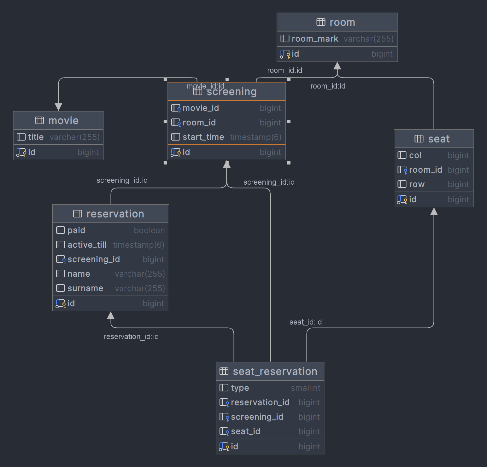

# Cinema ticket reservation system

The Cinema Seat Reservation App is a web application designed to allow users to reserve seats in a movie theater.

### Features

* User can select screening by time.
* Reservation of multiple seats in one screening.
* Prevents leaving empty seats between reserved seats.
* Reservations can only be done 15 minutes before the movie starts.

### Technologies
* Spring Boot
* PostgreSQL
* Docker Compose

### Guides
How to run it:

* Clone the Repository
* Build the Spring Boot Application using ./gradle build
* Build image and run docker-compose file using docker-compose up - it will start two docker containers, postgres database and cinema-service
* Application can be accessed in the browser using `http://localhost:8080`

#### Available endpoints:

* GET http://localhost:8080/movie with requestParams `?dateFrom=2023-01-01T10:30:00&dateEnd=2023-12-31T12:30:00` to fetch movies between dates
* GET http://localhost:8080/screening with requestParams `?screeningId=1`  fetch details about screening like seats or movie
* POST http://localhost:8080/reservation with requestBody - `ReservationRequest.class` to make a reservation

### Additional info

There is additional api_tests.http file with example http request showing basics usage of this application.

